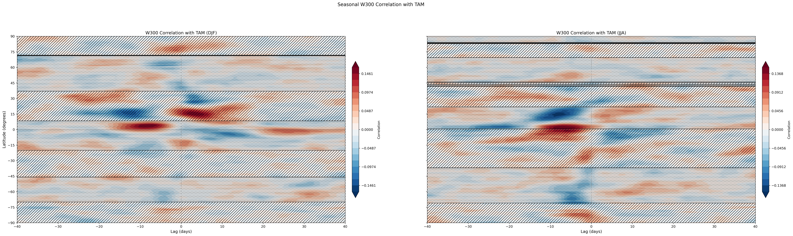
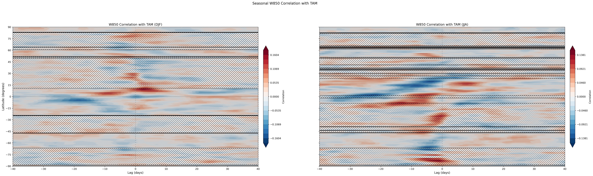
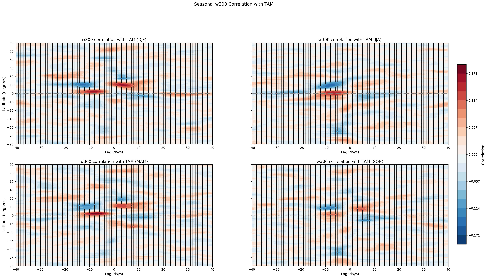
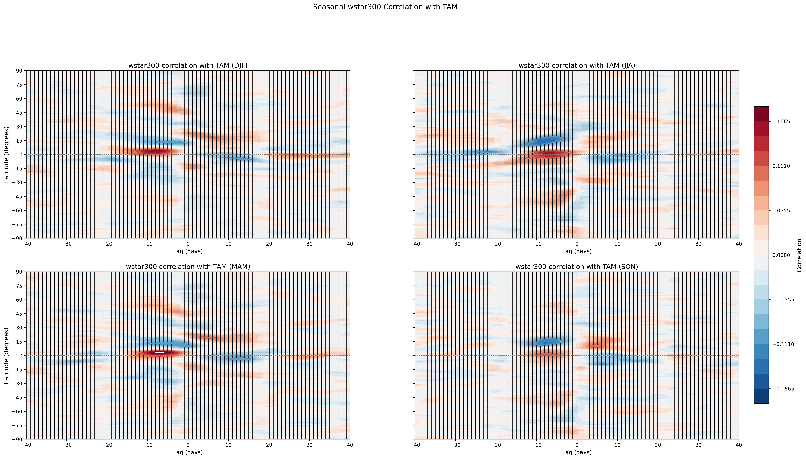

## 2026-05-28

### $\omega$ annual cycle analysis and projections of TAM correlation anoms
Investigated annual cycles of $\omega$ at 300 and 850 hPa, projected onto the correlation anomalies of $\omega$(300) and (850) x TAM.
See notebooks/z850indexanalysis.ipynb

Added significance test function to calculate and plot stippling on non-sig contour areas on the cross-correlation plots. 

## 2025-06-09

### TEM pressure velocity $\omega$* analysis and correlation with TAM
Calculated the TEM framework pressure velocity and correlated with TAM for DJF and JJA.

See notebooks/temanalysis.ipynb

_corr_seasonal.png)

## 2026-06-27

### Seasonal w300 lag correlation with TAM (all four seasons)

Extended seasonal analysis from DJF/JJA to all four seasons using corrected
`djf_jja_mam_son` function (fixed SON DOY off-by-one and year wrap with pad=40).

Visually, no notable change in structure across all seasons for omega at 300 hPa: 

Same analysis but on TEM omega at 300 hPa:

