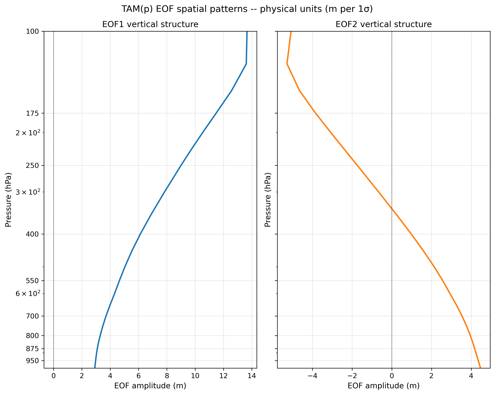
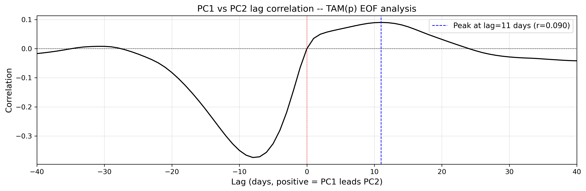
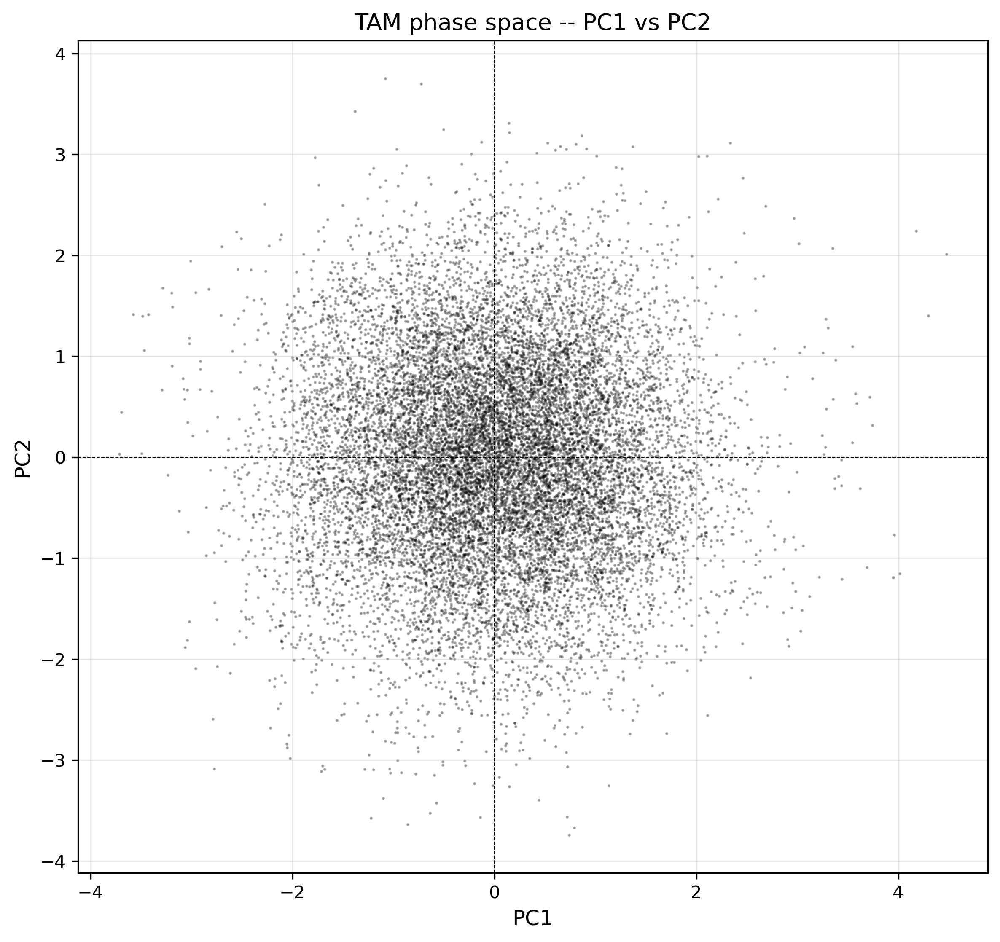
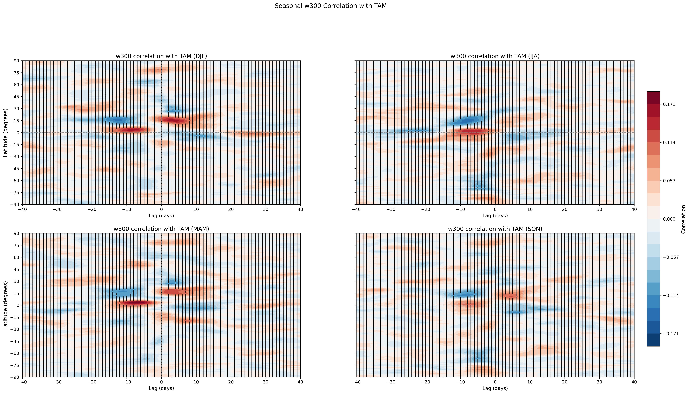
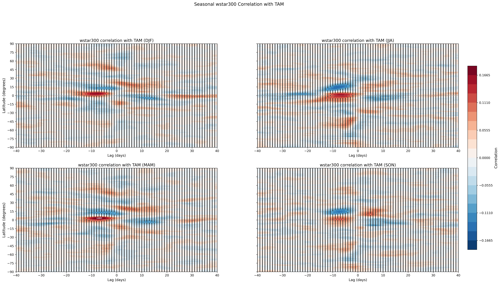
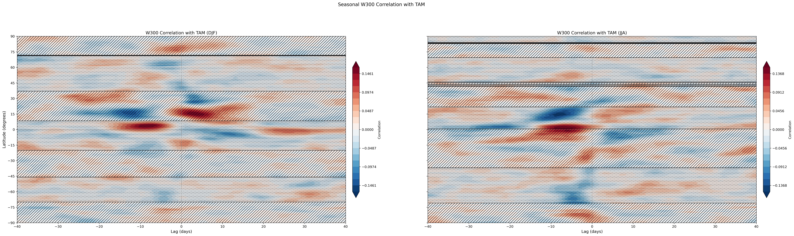
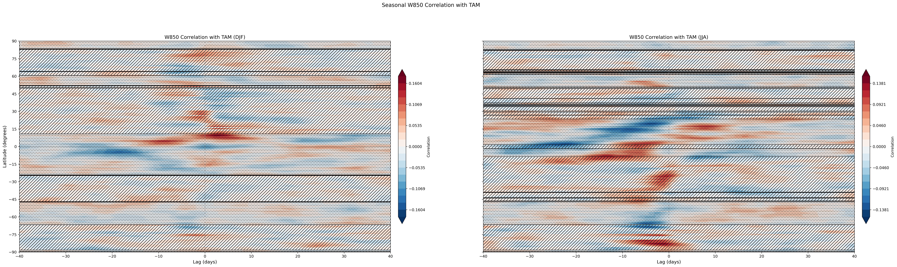

## 2026-07-07

### Developed more ways to define the TAM index via EOFs

Conducted an EOF analysis on daily zonal mean GPH anomalies latitudinally averaged from -15 to 15 degrees across 100-1000 hPa. 

The first two EOFs:
Variance explained by EOF1: 79.35%
Variance explained by EOF2: 19.34%
Variance explained by EOF1+2: 98.69%

EOF1 and EOF2 are shown below (physical units):

EOF1 is a dominating mode while EOF2 is a dipole. Performing a lagged cross-correlation of these two yields a lag-lead relationship:

EOF2 is negative ahead of EOF1, so there are positive GPH anomalies aloft, then EOF1 dominates after, resulting in the entire column having positive GPH anomalies. 

PC1 vs. PC2 phase space yields a circular structure, which could represent a cyclical pattern (work is being done to verify this):

## 2026-06-27

### Seasonal w300 lag correlation with TAM (all four seasons)

Extended seasonal analysis from DJF/JJA to all four seasons using corrected
`djf_jja_mam_son` function (fixed SON DOY off-by-one and year wrap with pad=40).

Visually, no notable change in structure across all seasons for omega at 300 hPa: 

Same analysis but on TEM omega at 300 hPa:

## 2025-06-09

### TEM pressure velocity $\omega$* analysis and correlation with TAM
Calculated the TEM framework pressure velocity and correlated with TAM for DJF and JJA.

See notebooks/temanalysis.ipynb

_corr_seasonal.png)

## 2026-05-28

### $\omega$ annual cycle analysis and projections of TAM correlation anoms
Investigated annual cycles of $\omega$ at 300 and 850 hPa, projected onto the correlation anomalies of $\omega$(300) and (850) x TAM.
See notebooks/z850indexanalysis.ipynb

Added significance test function to calculate and plot stippling on non-sig contour areas on the cross-correlation plots. 

